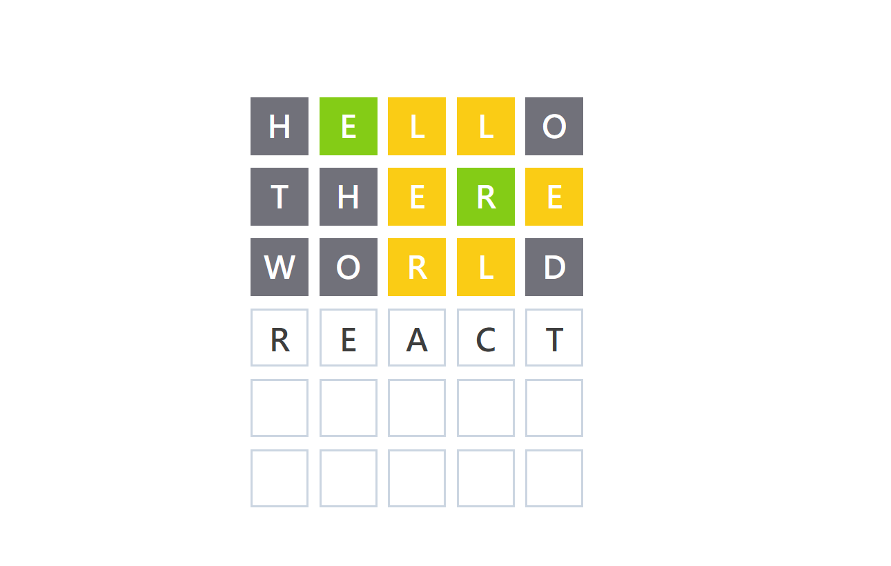
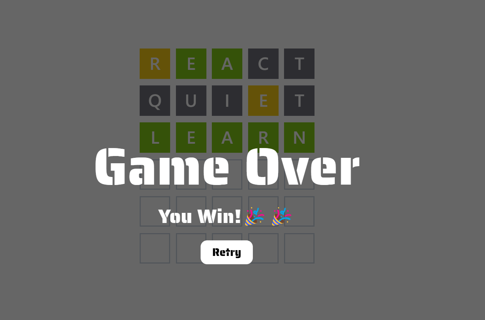

# Wordle Practice

  
  

This is a Wordle game project for practice purposes.

## Features

### Game Initialization

- **Select Random Word**: Randomly select a word from the word list stored in Firebase as the answer.

### User Input

- **Accept User Guesses**: Accept user word guesses through an input field.
- **Check Guess**: After entering a guess, check if it matches the answer.
- **Six Attempts**: Users have a total of six attempts to guess the word.

### Result Display

- **Show Guess Results**: Display the results of the user's guess, indicating which letters are correct and in the correct position, which letters are correct but in the wrong position, and which letters are not in the word.
  - **Yellow**: Correct letter but wrong position.
  - **Green**: Correct letter and correct position.
  - **Gray**: Letter not in the word.
- **Update Game State**: Update the game state based on the guess results.

### Game End

- **Check Game End**: Determine if the game has ended by checking if the user has guessed the word correctly or used all attempts.
- **Display End Message**: Show a message indicating the end of the game.
- **Retry Button**: Reset the game when the retry button is clicked.

## Technologies Used

- **React**
  - **Reducer**
- **Tailwind CSS**
- **TypeScript**
